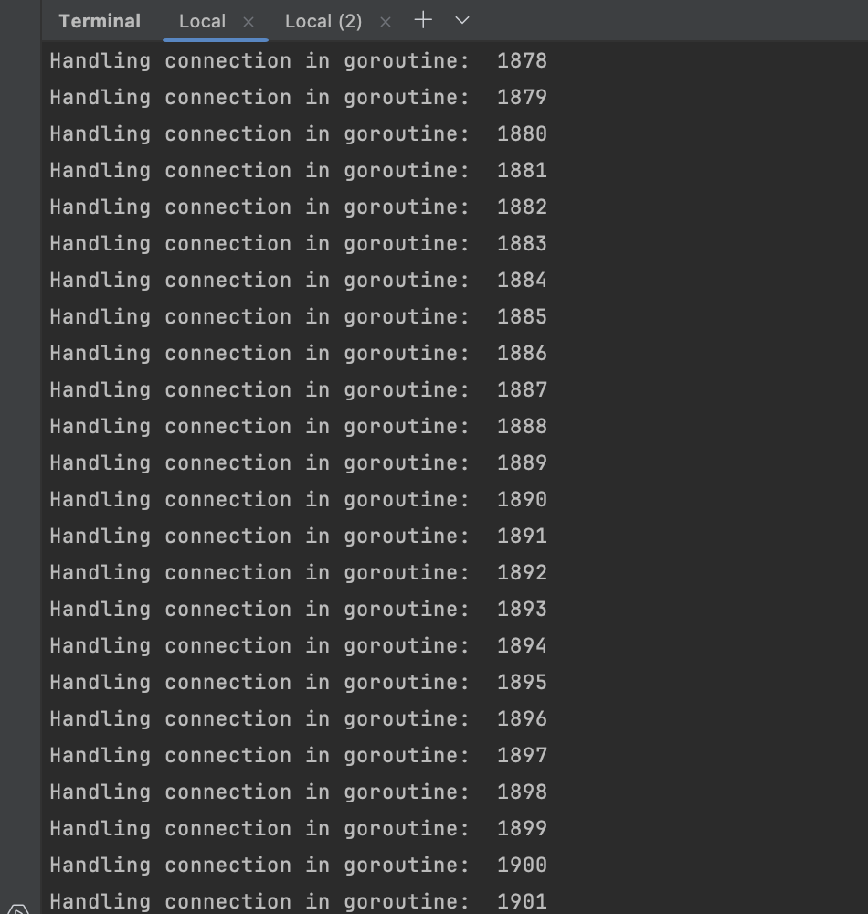

# BWS

BWS is a simple static file server written in Go. It serves files from a specified directory (`www` in this case) and handles concurrent requests using goroutines. The aim is to explain how web servers work in a minimal way and handle multiple client requests.

## Features

- **Concurrency**: Handles multiple client requests simultaneously using goroutines.
- **Security**: Prevents directory traversal attacks by ensuring that only files within the `www` directory are served.
- **Simplicity**: Designed to be minimal and easy to understand, making it a great learning tool for how web servers work.




## Installation
> Only tested on a unix like operating system

Clone the repository
```sh
    git clone https://github.com/6ogunt48/bws 
    cd https://github.com/6ogunt48/bws 
   ```

Ensure you have go installed
```sh
go version
```

### Running the server
To start the server, run the following command:
```sh
go run main.go
```

### Testing the server

You can use the provided request.sh script to send multiple concurrent requests to the server:

Make the script executable
```sh
chmod +x request.sh
```

Run the script
```shell
./request.sh
```
Challenge Source

This project was developed as a solution to a coding challenge from  [coding challenges](https://codingchallenges.fyi)